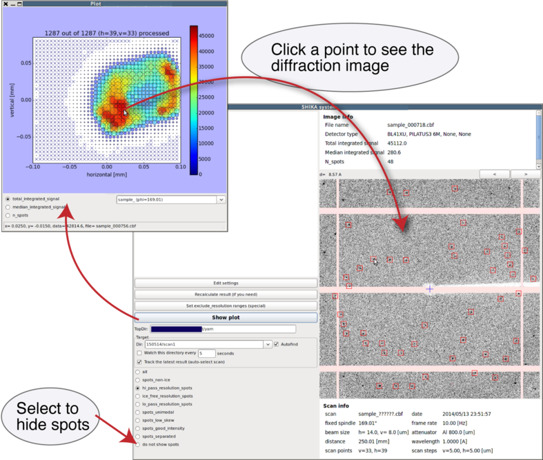
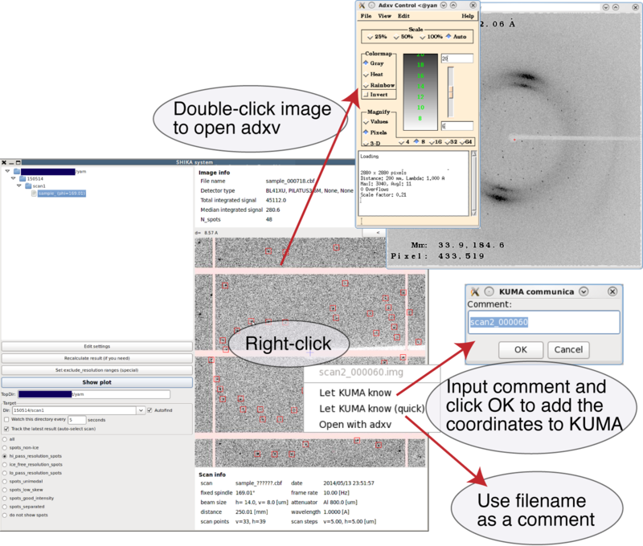
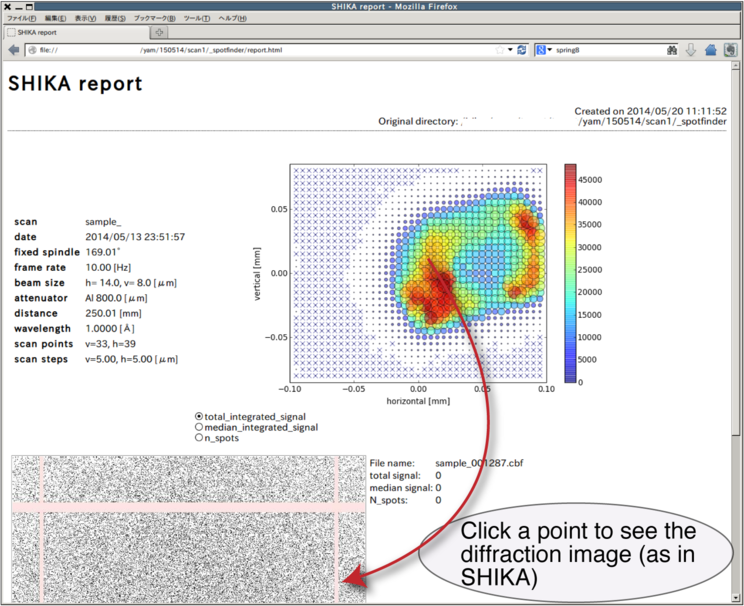

# SHIKAマニュアル for BL32XU/BL41XU

   * [SHIKAは何をするソフトか](#shikaは何をするソフトか)
   * [起動方法](#起動方法)
      * [最も一般的な使い方](#最も一般的な使い方)
   * [結果の見方](#結果の見方)
   * [adxvでの表示、KUMAとの連携](#adxvでの表示kumaとの連携)
   * [レポートHTMLについて](#レポートhtmlについて)
   * [SPring-8外で使いたい場合](#spring-8外で使いたい場合)
   * [バージョン履歴](#バージョン履歴)

## SHIKAは何をするソフトか
* BSSのDiffraction scanによって得られたイメージからスポットを拾い、結晶の位置を決めるためのプログラム (Spot wo Hirotte Ichiwo Kimeru Application)
* <s>DISTL ([Sauter et al. 2013](http://dx.doi.org/10.1107/S0907444913000863))をベースに開発中（XDSも使用可能）</s>
* 2016AからEIGER対応に伴い，ZMQを用いたCheetah ([Barty et al. 2014](http://www.desy.de/~barty/cheetah/Cheetah/Welcome.html))によるヒットファインドに切り替わり，GUIは表示機能のみになりました．詳細は[こちら](https://www.jstage.jst.go.jp/article/jcrsj/60/2-3/60_104/_pdf)の記事を参照．
* レポートを.html形式で保存（持ち帰った後で確認する用）
* KUMAとの連携あり（位置をKUMAに転送）

## 起動方法
結果を見たいディレクトリの上位ディレクトリへ移動し，

* BL32XUで実行する場合: `shika32xu`
* BL41XUで実行する場合: `shika41xu`

をビームラインローカルで実行してください．サブディレクトリを含む最新の結果が表示されます（ツリーも表示されます）．

ただしscanと同じディレクトリで起動しないでください（バグ）．
ホームディレクトリで実行しても大丈夫です．

## 結果の見方
Show plotを押すと，スキャンしたエリアにマップしたスコアが表示できます．
評価の方法は以下の3通りがありますが，多くの場合，n_spotsが最も良い指標になります．

* total_integrated_signal = 全スポットの合計強度
* median_integrated_signal = 全スポット強度の中央値
* n_spots = スポットの数

スキャンしたポイントをクリックすると，メイン画面に回折イメージが表示できます



## adxvでの表示、KUMAとの連携

* イメージをダブルクリックすると，adxvが起動します．
毎回閉じる必要はなく，他のイメージをダブルクリックするとそのイメージがロードされます．
* 右クリックして"Let KUMA know"を選ぶとダイアログが表示され，コメントを入力してOKを押すと、KUMAに座標を追加します。
（自動的に移動はしません）
* "Let KUMA know (quick)"は，KUMAに即座に座標を追加します（コメントにはファイル名が使用されます）



## レポートHTMLについて
* 持ち帰って見ていただくのレポートが、_spotfinder/report.htmlに保存されています。
* Firefoxでしかテストを行っていません。ご了承ください。
* イメージが多いときに重くなる問題を解消しました。
* SHIKAと同様、クリックすると下に回折写真が表示されます。



## SPring-8外で使いたい場合
持ち帰ったデータに対してGUIを立ち上げて結果を見たい場合，以下の手順を実行してください．
### インストール
[KAMOが導入](kamo-ja.md#dialsを利用した環境構築)されていれば僅かな変更で使用可能です．
（準備中）

### SHIKAの実行
結果を見たいスキャンよりも上のディレクトリで，
```
yamtbx.shika readonly=true
```
を実行してください．

## バージョン履歴
* 2013-10-09 名前がSHIKAに決まる
* 2013-10-10 水平スキャンの場合の方向間違いバグを修正
* 2013-10-16 スポット表示基準の切り替えを高速に。I vs resolutionのプロットを追加(デバッグ用）
* 2013-10-24 “Watch this directory”機能を追加
* 2013-10-26 別スレッドを利用したスムーズな結果更新
* 2013-10-27 大量のイメージが表示される場合に重くなる問題に対処（一度に読まない）
* 2013-11-07 XDSを利用したスポット拾い機能を追加(SHIKA-X)。プロット画面でのゴニオ角度とファイル名の表示。
* 2013-11-08 ディレクトリの切り替え機能を追加（いちいち立ち上げ直さなくて良くなった）
* 2013-11-10 スポット拾いの結果を_spotfinder/result.pklとして保存
* 2013-11-13 adxvとの連携を追加
* 2013-11-14 XDSを利用する際、DEFPIXを実行してbeam stop shadowを除くようにした。KUMAとの連携を追加。
* 2013-11-19 ユーザ持ち帰り用のレポートファイルを_spotfinder/report.htmlとして出力。Canvas使用（重い）。プロットのクリックも可能。
* 2013-11-26 コントロール画面をメイン画面に統合。ビームセンターの表示がずれていた問題を修正。
* 2013-12-16 SHIKA-XをRAMドライブ上で実行するように変更(x2 speed up)。
* 2014-02-05 spot type表示/切替が不完全だったバグを修正
* 2014-04-15 shutterless diffraction scanに対応
* 2014-04-16 画像変換を自前実装＋jpeg出力に変更(かなり高速化)
* 2014-05-06 メイン画面を刷新。回折写真は1つのみ表示。イメージ・スキャンの詳細の表示。大量イメージ処理時にGUIが重くなる問題を修正。
* 2014-05-09 BL/検出器ごとのデフォルト設定変更を可能にし、設定画面を別ウィンドウに。跡地にディレクトリのツリーを表示。
* 2014-05-13 BL41XUに対応
* 2014-05-15 HTML reportを軽量化
* 2014-05-16 イメージをキーボード/ボタンで前後に送れるようにした
* 2015-04-10 Auto-select機能を搭載
* 2015-07-01 auto\_modeを追加
* 2015-07-06 PPU上で実行するモードの追加
* 2016-04-07 BackendとGUIの切り離し． Cheetah利用(外部)へ切り替え
* 2019-04-13 Pilatus対応
